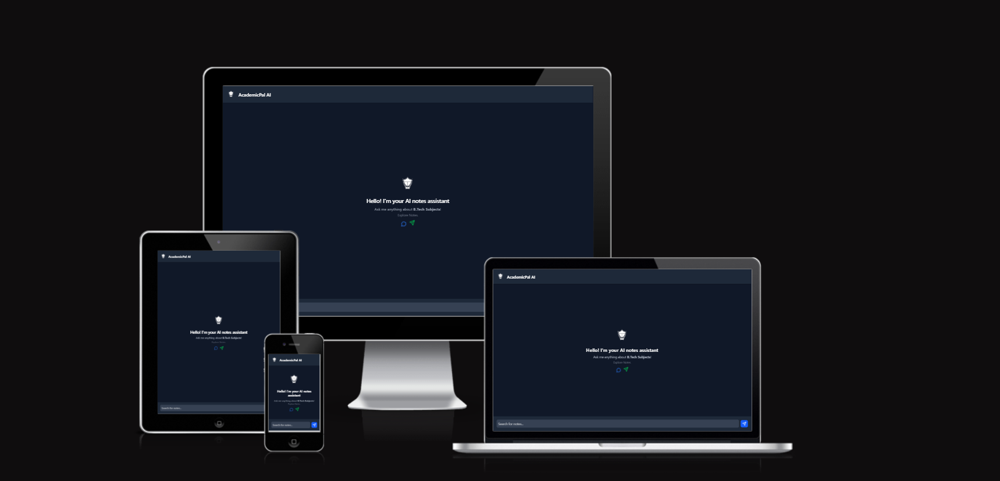

# 📚 AcademicPal AI Search



🚀 **AcademicPal AI Search** is an AI-powered assistant designed to help students find notes, resources, and explanations for B.Tech subjects. Built with an advanced **machine learning model** and a modern **Vite + React** frontend, it delivers seamless and intelligent search capabilities.

## 🌟 Features
- 🔍 AI-powered search for academic notes
- 📖 Supports multiple subjects like Python, Math, Physics, and Chemistry
- ✨ Fully responsive UI with **React + Tailwind CSS**
- ⚡ Fast and efficient with **Flask-based ML model**
- 🔗 Detects and formats links in responses automatically


---

## 🛠️ Tech Stack

### 🚀 Frontend  
| Tech               | Icon                                                                                 | Purpose                                  |  
|--------------------|-------------------------------------------------------------------------------------|------------------------------------------|  
| **React**         |       | UI development                           |  
| **TypeScript**    |       | Static typing for scalability            |  
| **Tailwind CSS**  |      | Styling                                  |  
| **Vite**          |                         | Fast frontend tooling                    |  
| **Lucide Icons**  |             | Icon library for UI elements             |

### 🧠 Machine Learning  
| Tech             | Icon                                                                                 | Purpose                                  |  
|-----------------|-------------------------------------------------------------------------------------|------------------------------------------|  
| **Flask**       |                      | Backend for ML processing                |  
| **Pandas**      |                  | Data processing                          |  
| **Scikit-Learn**|  | Machine learning algorithms              |  
| **NLTK**        |                       | Natural language processing              |  
| **NumPy**       |                      | Numerical computing                      |

---

## 🚀 Installation & Setup

### Prerequisites
- Node.js & npm
- Python 3

### 🔧 Frontend Setup
```bash
# Clone the repository
git clone https://github.com/Hari-hara7/Academicpal-ml-chatbot.git
cd academicpal-ai/frontend

# Install dependencies
npm install

# Start the development server
npm run dev
```

### 🧠 Backend (ML) Setup
```bash
cd ../backend

# Create virtual environment
python -m venv venv
source venv/bin/activate  # On Windows, use `venv\Scripts\activate`

# Install dependencies
pip install -r requirements.txt

# Run the Flask server
python app.py
```

---

## 👨‍💻 Contributors

| Contributor | GitHub Profile |
|------------|---------------|
| **Hariharanath** (Founder & Lead Developer) | [](https://github.com/Hari-hara7) |
| **Teja** (ML Developer) | [](https://github.com/GunaTeja777) |

---

## 📜 License
This project is licensed under the **MIT License**.

---

🌟 **Star this repository** if you like AcademicPal AI and find it helpful! 🚀
